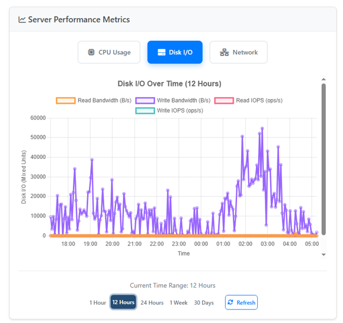

# ☁️ Free WHMCS Hetzner Cloud Module (OpenSource)

[](https://github.com/lastwall/whmcs-hetzner-cloud-automation/releases)
[](#-contributing)
[](https://github.com/lastwall/whmcs-hetzner-cloud-automation/stargazers)[](https://github.com/lastwall/whmcs-hetzner-cloud-automation/stargazers)


A **comprehensive WHMCS provisioning module** for **Hetzner Cloud**, providing automated **server creation, management, monitoring, and termination** directly from WHMCS with advanced features and professional UI.


## **🌟 Core Features**
✅ **Automatic Server Creation & Management**

✅ **Advanced Power Operations** (Power On/Off, Reboot, Shutdown)

✅ **Web Console Integration** (noVNC) for direct server access

✅ **Auto-Suspend & Terminate** services

## **🌟 New Version 2 Features 🔥**

✅ **Server Rebuild & OS Management** with ISO support 🆕

✅ **Real-time Performance Monitoring** with interactive charts 🆕

✅ **Live Status Monitoring** with heartbeat indicators 🆕

✅ **Password Reset & Security Management** 🆕

✅ **Rebuild Responsive Design** 🆕

##

## **📊 Monitoring & Analytics**
- **Real-time Metrics**: CPU, Disk I/O, Network performance
- **Interactive Charts**: Chart.js powered visualizations
- **Multiple Time Ranges**: 1 hour to 30 days historical data
- **Live Updates**: Automatic refresh with status indicators
- **Resource Usage**: Current consumption with detailed tooltips

## **📖 Installation Guide**
Follow these steps to install and configure the module in WHMCS.

### **1️⃣ Download & Upload**
1. **Download the latest release** from [GitHub Releases](https://github.com/lastwall/whmcs-hetzner-cloud-automation/releases/tag/release)
2. Extract and **upload** the module folder to:  
   ```
   WHMCS installation root/modules/servers/hetznercloud
   ```

### **2️⃣ Configure WHMCS**
1. **Login to WHMCS Admin Panel**  
2. Navigate to **Setup → Products/Services → Servers**  
3. Click **Add New Server** and enter:  
   - **Name:** Hetzner Cloud  
   - **Access Hash:** (Generate from your Hetzner account)  
   - **Module Type:** `Hetzner Cloud Server Automation`  
4. Click **Save Changes**

### **3️⃣ Create a Product**
1. Go to **Setup → Products/Services → Products**  
2. Click **Create a New Product**  
3. Under **Module Settings**, select `Hetzner Cloud Server Automation`  
4. Configure the product settings (plan only, other settings are custom field)  
5. Click **Save Changes**  

### **4️⃣ Required Custom Field**
WHMCS requires a **custom field** to store the Hetzner **server ID**.  
Go to **Setup → Products/Services → Custom Fields** and create:  

| Field Name | Type | Required | Description |
|------------|------|----------|-------------|
| `serverID` | Text Box | No(Only Admin) | Stores the Hetzner Cloud Server ID |
| `location` | Dropdown | Yes | Available Hetzner datacenters (e.g., fsn1, nbg1, hel1) |
| `os_image` | Dropdown | Yes | Available OS images (e.g., ubuntu-22.04, debian-11, centos-8) |

## **⚡ Usage & Features**
- **Clients** can order and manage **Hetzner Cloud servers** from WHMCS  
- **Real-time monitoring** with performance metrics and status updates
- **Web console access** for direct server management
- **Advanced server operations** including rebuild, ISO management, and password reset
- **Automatic provisioning** and lifecycle management via Hetzner API

## **🔧 Technical Requirements**
- WHMCS 8.0 or higher
- PHP 7.4 or higher  
- cURL extension enabled
- Hetzner Cloud API token

## **💡 Troubleshooting**
### **1️⃣ Debugging API Errors**
Enable **WHMCS Module Debug Mode**:  
1. Go to **Utilities → Logs → Module Log**  
2. Click **Enable Debug Logging**  
3. Re-run the module and check the logs  

### **2️⃣ Server ID Not Saving?**
Make sure the **custom field name** is exactly:  
```
serverID
```
If the issue persists, check the **WHMCS Activity Log**.

## **📌 Contributing**
We welcome contributions! Follow these steps to contribute:  

---

## **📜 License**
This project is licensed under the **MIT License**. See the [LICENSE](LICENSE) file for details.

## **🔄 Version History**

### **v2.0.0 (Current)**
- Complete UI redesign with responsive layout
- Real-time metrics and live status updates
- Advanced charting with Chart.js integration
- Optimized API client with improved performance
- Mobile-first responsive design
- Live heartbeat status indicators
- Comprehensive error handling and logging
- Web console integration (noVNC)
- Advanced server operations (rebuild, ISO management, password reset)
- **Centralized versioning system** for easy updates

### **v1.0.0**
- Basic server management functionality
- Simple status monitoring
- Basic power controls
- Initial WHMCS integration

---

## **🌍 Connect With Me**

📢 **GitHub:** [github.com/lastwall](https://github.com/lastwall)  

---

⭐ **If you use this module useful, please give it a star!** ⭐

⚠️ **If There is any bug let me know** ⚠️
