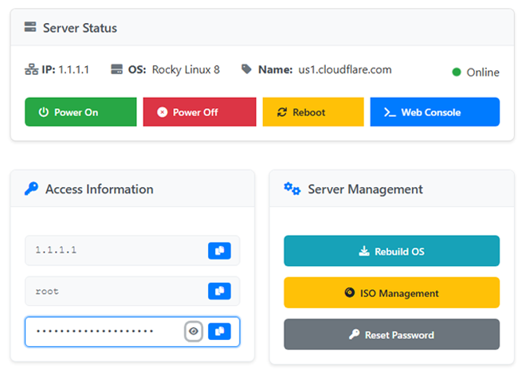

# ☁️ WHMCS Hetzner Cloud Module

A **WHMCS provisioning module** for **Hetzner Cloud**, allowing automated **server creation, Console, management, and termination** directly from WHMCS.





 [](#-contributing)  [](https://github.com/lastwall/whmcs-hetzner-cloud-automation/stargazers)


## **🌟 Features Done**
✅ **Automatic Server Creation**

✅ **Auto-Suspend & Terminate**

✅ **Custom Server Configurations**

✅ **WHMCS Admin Panel Integration**

✅ **noVNC Console Integration**

---
## **🌟 In Progress**
🔜** Rebuild Server **

🔜**Reset Password**

🔜**Upgrade/Downgrade Server**

🔜**Network Graphs & Usage Stats**


## **📖 Installation Guide**
Follow these steps to install and configure the module in WHMCS.

### **1️⃣ Download & Upload**
1. **Download the latest release** from [GitHub Releases](https://github.com/lastwall/whmcs-hetzner-cloud-automation/releases/tag/release)
2. Extract and **upload** the module folder to:  
   ```
   WHMCS installation root/modules/servers/hetznercloud
   ```

### **2️⃣ Configure WHMCS**
1. **Login to WHMCS Admin Panel**  
2. Navigate to **Setup → Products/Services → Servers**  
3. Click **Add New Server** and enter:  
   - **Name:** Hetzner Cloud  
   - **Access Hash:** (Generate from your Hetzner account)  
   - **Module Type:** `Hetzner Cloud Server Automation`  
4. Click **Save Changes**

### **3️⃣ Create a Product**
1. Go to **Setup → Products/Services → Products**  
2. Click **Create a New Product**  
3. Under **Module Settings**, select `Hetzner Cloud Server Automation`  
4. Configure the product settings (plan only, other settings are custom field)  
5. Click **Save Changes**  

### **4️⃣ Required Custom Field**
WHMCS requires a **custom field** to store the Hetzner **server ID**.  
Go to **Setup → Products/Services → Custom Fields** and create:  

| Field Name | Type | Required | Description |
|------------|------|----------|-------------|
| `serverID` | Text Box | No(Only Admin) | Stores the Hetzner Cloud Server ID |
| `location` | Dropdown | Yes | Available Hetzner datacenters (e.g., fsn1, nbg1, hel1) |
| `os_image` | Dropdown | Yes | Available OS images (e.g., ubuntu-22.04, debian-11, centos-8) |
---

## **⚡ Usage**
- **Clients** can order a **Hetzner Cloud server** from WHMCS  
- **WHMCS will automatically provision the server** via the Hetzner API  
- **Suspend/Terminate actions** will also be handled automatically  

---

## **💡 Troubleshooting**
### **1️⃣ Debugging API Errors**
Enable **WHMCS Module Debug Mode**:  
1. Go to **Utilities → Logs → Module Log**  
2. Click **Enable Debug Logging**  
3. Re-run the module and check the logs  

### **2️⃣ Server ID Not Saving?**
Make sure the **custom field name** is exactly:  
```
serverID
```
If the issue persists, check the **WHMCS Activity Log**.

---

## **📌 Contributing**
We welcome contributions! Follow these steps to contribute:  

---

## **📜 License**
This project is licensed under the **MIT License**. See the [LICENSE](LICENSE) file for details.

---

## **🌍 Connect With Me**

📢 **GitHub:** [github.com/lastwall](https://github.com/lastwall)  


---

⭐ **If you use this module useful, please give it a star!** ⭐

⚠️ **If There is any bug let me know** ⚠️
